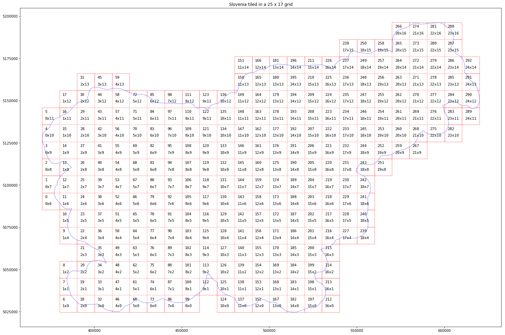
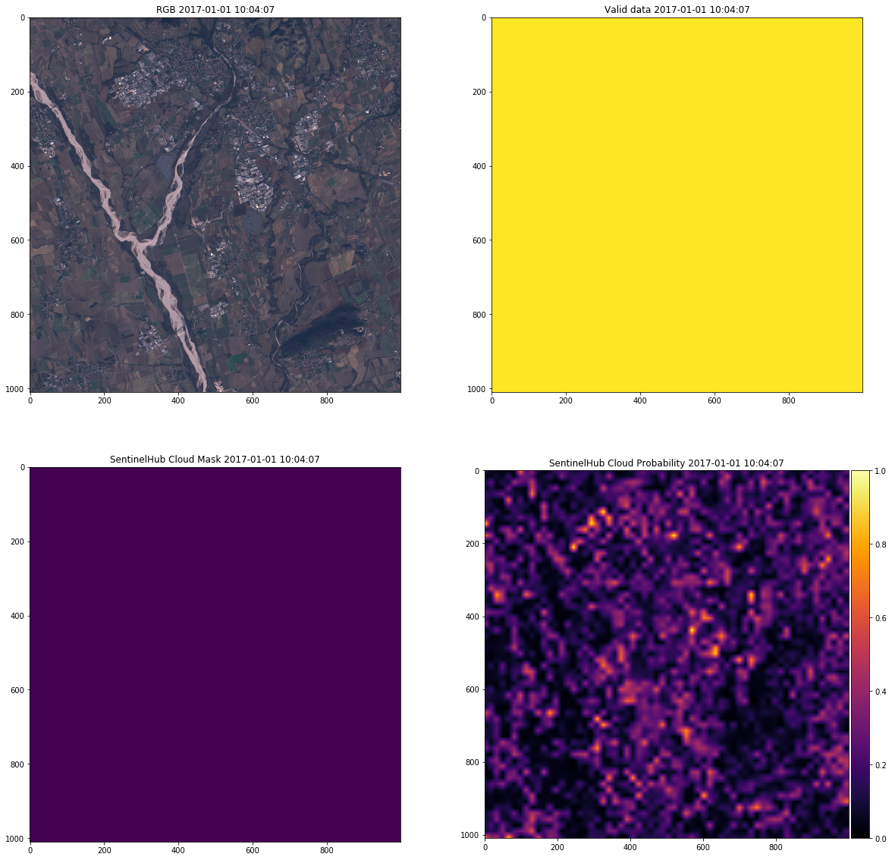
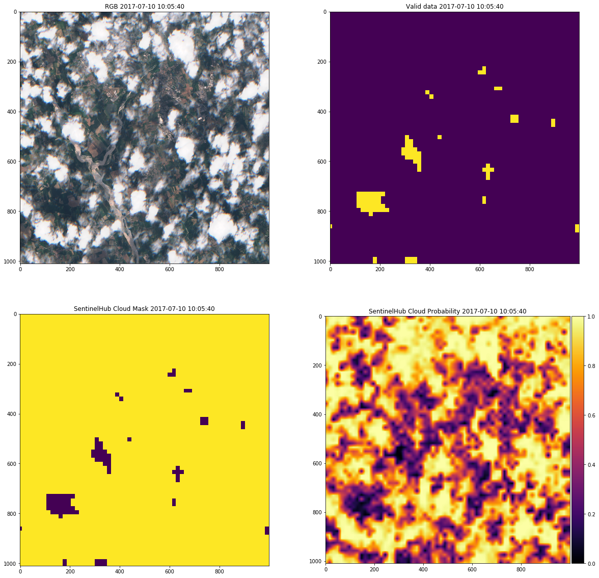
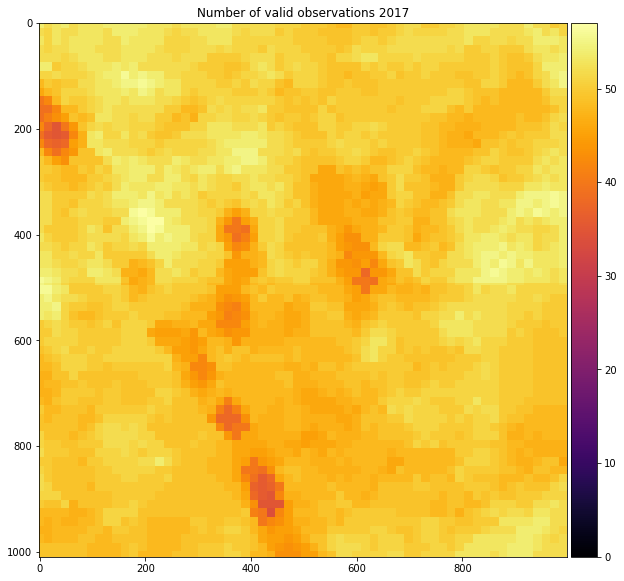
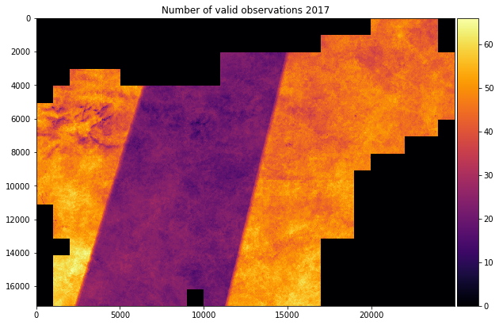
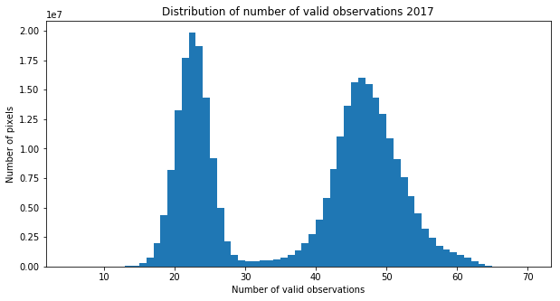
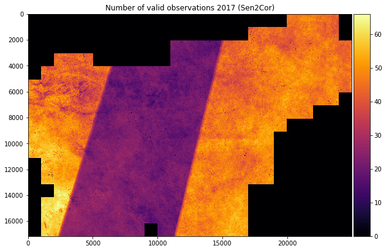
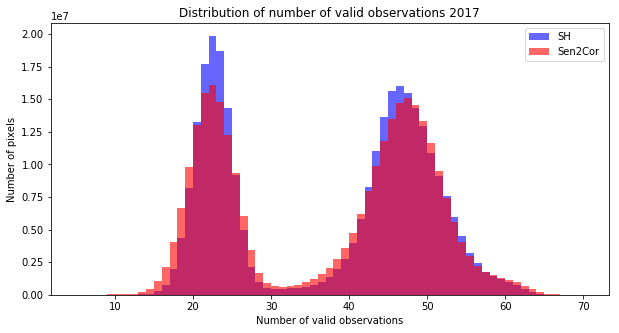

# Land Use and Land Cover (LULC) classification example

This example showcases how it's possible to perform an automatic LULC classification 
on a country scale (Slovenia taken as an example) using the `eo-learn` package. The
classification is performed on a time-series of all Sentinel-2 scenes from 2017.

The example is separated into multiple steps, where different aspects of the workflow are 
explained. 

##### Requirements

In order to run the example you'll need a Sentinel Hub account. You can get a trial version [here](https://www.sentinel-hub.com).

Once you have the account set up, login to [Sentinel Hub Configurator](https://apps.sentinel-hub.com/configurator/). By default you will already have the default confoguration with an **instance ID** (alpha-numeric code of length 36). For this tutorial it is recommended that you create a new configuration (`"Add new configuration"`) and set the configuration to be based on **Python scripts template**. Such configuration will already contain all layers used in these examples. Otherwise you will have to define the layers for your  configuration yourself.

After you have decided which configuration to use, you have two options You can either put configuration's **instance ID** into `sentinelhub` package's configuration file following the [configuration instructions](http://sentinelhub-py.readthedocs.io/en/latest/configure.html) or you can write it down in the example notebooks.

__Note: The full end-to-end LULC workflow is not yet shown in the example so make sure to
check regularly for the updates.__

---

## 1. Split area of interest into tiles

The area of interest (AOI) at a country level is too large and needs to be tiled into smaller
pieces in order to be able to fit the one-year-long time series into memory. 
Each smaller piece is called an `EOPatch` in the `eo-learn` package. In order to create an 
`EOPatch` we simply need the bounding box in a given coordinate reference system. We'll
use `BBOXSplitter` from [`sentinelhub`](https://github.com/sentinel-hub/sentinelhub-py) python package.

**Notebook: 1_split-AOI.ipynb**
* Inputs:
    * a geo-json file defining the AOI. In our case, a buffered version of Slovenia. (`reference-data/slovenia-def/svn_buffered.geojson`)
* Outputs:
    * pickled `BBoxSplitter` with 293 tiles (seeds for 293 `EOPatch`es)
    * geopandas dataframe of tiles

**Figure:** AOI (Slovenia) tiled into smaller rectangular tiles.

## 2. Create EOPatches

Now is time to create an `EOPatch` for each out of 293 tiles of the AOI. The `EOPatch` is created by filling it with Sentinel-2 data using Sentinel Hub services. We will add the following data to each `EOPatch`:
* L1C RGB (bands B04, B03, and B02) 
* cloud probability and cloud mask from SentinelHub's `s2cloudless` cloud detector
    * in order to perform the cloud detection the 10 L1C bands needed by the `s2cloudless` cloud detector are going to be downloaded (and removed before saving)
    
### 2.1 Determine the number of valid observations

We can count how many times in a time series a pixel is valid or not from the or SentinelHub's cloud mask.

**Notebook: 2_eopatch-L1C.ipynb**
* Inputs:
    * pickled `BBoxSplitter` with 293 tiles (seeds for 293 `EOPatch`es)
* Outputs:
    * `EOPatch`(es) with the following content:
        * cloud probability map per frame
        * cloud mask per frame
        * `IS_DATA` mask
        * `VALID_DATA` mask
        * map of number of valid frames per pixel
        * fraction of valid pixels per frame
    * geo-referenced tiff files with number of valid observations 
* Tasks (this example shows how to):
    * create an EOPatch and fill it with data (Sentinel-2 L1C) using SentinelHub services
    * run SentinelHub's cloud detector (`s2cloudless`)
    * remove features from an EOPatch
    * validate pixels using custom (user-specified) predicate
    * count number of valid observations per pixel 
    * export a feature to geo-referenced tiff file 
    * add custom (user-defined) feature to EOPatch
    * remove frames from an EOPatch using custom custom (user-specified) predicate
    * save EOPatch to disk
    * load EOPatch from disk
    
If we take a look into the first `EOPatch` this is what we'll find:

A. Visualise a couple of frames 

 

**Figure:** Frame with index 0 for an `EOPatch`.

 

**Figure:** Frame with index 31 for the same `EOPatch`.

B. Number of valid observations per EOPatch and entire AOI

**Figure:** Number of valid observations for an `EOPatch` with index 0.

**Figure:** Number of valid Sentinel-2 observations for Slovenia in 2017. This image can be created by merging all geo-referenced tiffs into a single one using `gdal_merge.py`.

**Figure:** Distribution of number of valid Senintel-2 observations for Slovenia in 2017. 

**Figure:** Fraction of valid pixels per frame for an EOPatch with index 0.

**Figure:** Fraction of valid pixels per frame for an EOPatch with index 0 with frames with this fraction below 60% removed.

**Notebook: 2_eopatch-L2A.ipynb**

This notebook does almost the same thing as the notebook `2_eopatch-L1C.ipynb`. The main difference that here the input source is Sentinel-2 L2A (bottom of atmosphere or atmosphericaly corrected refelectances) produced with Sen2Cor. The cloud and cloud shadow masking is based on Sen2Cor's scene classification. 

**Figure:** Number of valid Sentinel-2 observations for Slovenia in 2017 as determined from Sen2Cor's scene classification.  

**Figure:** Distributions of number of valid Senintel-2 observations for Slovenia in 2017 as determined using Sen2Cor's scene classification in red and Sentinel Hub's cloud detector `s2cloudless` in blue. 

